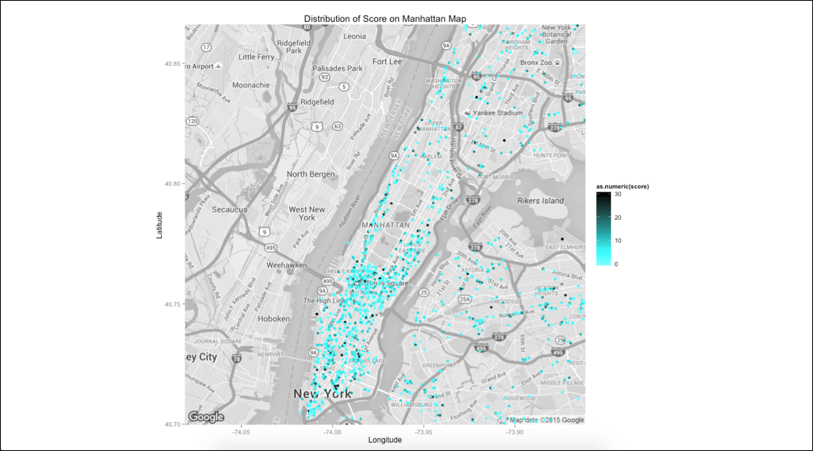

#Restaurant Inspection#
Eating out is a big part of our lives, yet we do not necessarily take the necessary step to make sure what we eat is healthy and clean. This project aimed at studying the score of restaurants' scores in NYC. 

  
This project focuses on the application of statistics concepts such as Permutation Test, Bootstrap, Confidence Interval and Regression Analysis. At the same time, it was a good opportunity to work with different packages such as *mosaic*, *ggmap* and more.  

Here are some sample interesting plots we have found during the course of this project:

**Author**: [Anh Vu Nguyen](https://www.linkedin.com/in/nlavu), [Anh Nguyen](https://www.linkedin.com/in/haanhnguyend) and [Cody Couture](https://www.linkedin.com/in/codycouture)

